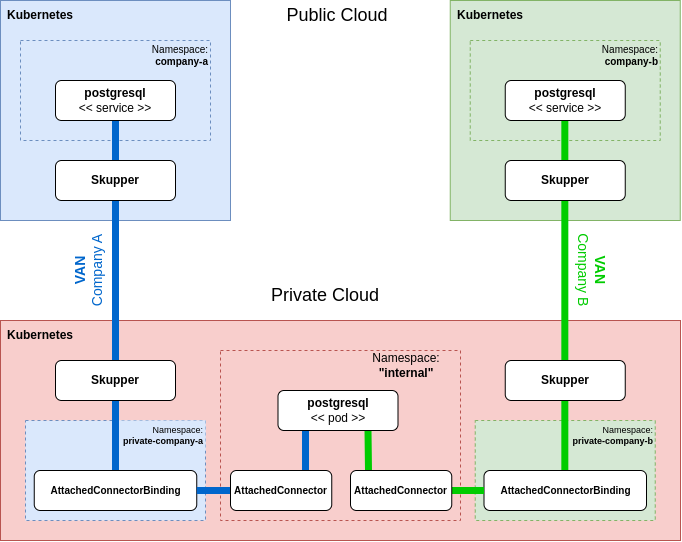

<!-- NOTE: This file is generated from skewer.yaml.  Do not edit it directly. -->

# Sharing a PostgreSQL database with distinct VANs

#### This tutorial demonstrates how to share a PostgreSQL database running on a namespace, without a Skupper site, with two distinct Virtual Application Networks.

This example is part of a [suite of examples][examples] showing the
different ways you can use [Skupper][website] to connect services
across cloud providers, data centers, and edge sites.

[website]: https://skupper.io/
[examples]: https://skupper.io/examples/index.html

#### Contents

* [Overview](#overview)
* [Prerequisites](#prerequisites)
* [Step 1: Access your Kubernetes clusters](#step-1-access-your-kubernetes-clusters)
* [Step 2: Install Skupper on your Kubernetes clusters](#step-2-install-skupper-on-your-kubernetes-clusters)
* [Step 3: Create your Kubernetes namespaces](#step-3-create-your-kubernetes-namespaces)
* [Step 4: Set up the demo](#step-4-set-up-the-demo)
* [Step 5: Create your sites](#step-5-create-your-sites)
* [Step 6: Link your sites](#step-6-link-your-sites)
* [Step 7: Deploy the PostgreSQL service](#step-7-deploy-the-postgresql-service)
* [Step 8: Expose the PostgreSQL on the Virtual Application Networks](#step-8-expose-the-postgresql-on-the-virtual-application-networks)
* [Step 9: Making the PostgreSQL database accessible to the each VAN](#step-9-making-the-postgresql-database-accessible-to-the-each-van)
* [Step 10: Create pod with PostgreSQL client utilities](#step-10-create-pod-with-postgresql-client-utilities)
* [Step 11: Create databases, a table and insert values](#step-11-create-databases-a-table-and-insert-values)
* [Step 12: Access the product table from both sites](#step-12-access-the-product-table-from-both-sites)
* [Cleaning up](#cleaning-up)
* [Summary](#summary)
* [Next steps](#next-steps)
* [About this example](#about-this-example)

## Overview

In this tutorial, you will create two distinct Virtual Application Neworks (VANs) that enable communications across private and public clusters.

You will then deploy a PostgreSQL database instance to a private cluster.
The namespace where the database runs is not connected to any Virtual Application Network so we will use **_Attached Connectors_** to allow the
database pods to be exposed by two distinct VANs, running in different namespaces within the same cluster.

This will enable clients running alongside these separate Virtual Application Neworks to transparently access the database,
without the need for additional networking setup (e.g. no vpn or sdn required).

Here is an overview of the topology used by this example:

## Prerequisites

* Access to at least one Kubernetes cluster, from [any provider you
  choose][kube-providers].

* The `kubectl` command-line tool, version 1.15 or later
  ([installation guide][install-kubectl]).

[kube-providers]: https://skupper.io/start/kubernetes.html
[install-kubectl]: https://kubernetes.io/docs/tasks/tools/install-kubectl/

The basis for the demonstration is to depict the operation of a PostgreSQL database in a private cloud cluster, on a namespace that is not connected
to any Virtual Application Network, but allows two internal namespaces to expose the database pods into the distinct VANs they are connected with.

With that, we provide access to the database from clients resident on any cluster connected to these two separate VANs.

As an example, the cluster deployment might be comprised of:

* A private cloud cluster running on your local machine
* Two public cloud clusters running on a public cloud provider

While the detailed steps are not included here, this demonstration can alternatively be performed with five separate namespaces on a single cluster.

## Step 1: Access your Kubernetes clusters

Skupper is designed for use with multiple Kubernetes clusters.
The `skupper` and `kubectl` commands use your
[kubeconfig][kubeconfig] and current context to select the cluster
and namespace where they operate.

[kubeconfig]: https://kubernetes.io/docs/concepts/configuration/organize-cluster-access-kubeconfig/

This example uses multiple cluster contexts at once. The
`KUBECONFIG` environment variable tells `skupper` and `kubectl`
which kubeconfig to use.

For each cluster, open a new terminal window.  In each terminal,
set the `KUBECONFIG` environment variable to a different path and
log in to your cluster.

_**Company A public cluster:**_

~~~ shell
export KUBECONFIG=$PWD/kubeconfigs/company-a.config
<provider-specific login command>
~~~

_**Company A private cluster:**_

~~~ shell
export KUBECONFIG=$PWD/kubeconfigs/private-company-a.config
<provider-specific login command>
~~~

_**Company B public cluster:**_

~~~ shell
export KUBECONFIG=$PWD/kubeconfigs/company-b.config
<provider-specific login command>
~~~

_**Company B private cluster:**_

~~~ shell
export KUBECONFIG=$PWD/kubeconfigs/private-company-b.config
<provider-specific login command>
~~~

_**Internal namespace on private cluster:**_

~~~ shell
export KUBECONFIG=$PWD/kubeconfigs/internal.config
<provider-specific login command>
~~~

**Note:** The login procedure varies by provider.

## Step 2: Install Skupper on your Kubernetes clusters

Using Skupper on Kubernetes requires the installation of the
Skupper custom resource definitions (CRDs) and the Skupper
controller.

For each cluster, use `kubectl apply` with the Skupper
installation YAML to install the CRDs and controller.

_**Company A public cluster:**_

~~~ shell
kubectl apply -f https://skupper.io/v2/install.yaml
~~~

_**Company A private cluster:**_

~~~ shell
kubectl apply -f https://skupper.io/v2/install.yaml
~~~

_**Company B public cluster:**_

~~~ shell
kubectl apply -f https://skupper.io/v2/install.yaml
~~~

_**Company B private cluster:**_

~~~ shell
kubectl apply -f https://skupper.io/v2/install.yaml
~~~

_**Internal namespace on private cluster:**_

~~~ shell
kubectl apply -f https://skupper.io/v2/install.yaml
~~~

## Step 3: Create your Kubernetes namespaces

The example application has different components deployed to
different Kubernetes namespaces.  To set up our example, we need
to create the namespaces.

For each cluster, use `kubectl create namespace` and `kubectl
config set-context` to create the namespace you wish to use and
set the namespace on your current context.

_**Company A public cluster:**_

~~~ shell
kubectl create namespace company-a
kubectl config set-context --current --namespace company-a
~~~

_**Company A private cluster:**_

~~~ shell
kubectl create namespace private-company-a
kubectl config set-context --current --namespace private-company-a
~~~

_**Company B public cluster:**_

~~~ shell
kubectl create namespace company-b
kubectl config set-context --current --namespace company-b
~~~

_**Company B private cluster:**_

~~~ shell
kubectl create namespace private-company-b
kubectl config set-context --current --namespace private-company-b
~~~

_**Internal namespace on private cluster:**_

~~~ shell
kubectl create namespace internal
kubectl config set-context --current --namespace internal
~~~

## Step 4: Set up the demo

On your local machine, make a directory for this tutorial and clone the example repo:

_**Company A public cluster:**_

~~~ shell
cd ~/
mkdir pg-demo
cd pg-demo
git clone https://github.com/fgiorgetti/skupper-example-postgresql-attached-connector.git
~~~

## Step 5: Create your sites

A Skupper _Site_ is a location where your application workloads
are running. Sites are linked together to form a network for your
application.

Use the `kubectl apply` command to declaratively create sites in the kubernetes
namespaces. This deploys the Skupper router. Then use `kubectl get site` to see
the outcome.

  **Note:** If you are using Minikube, you need to [start minikube
  tunnel][minikube-tunnel] before you configure skupper.

  [minikube-tunnel]: https://skupper.io/start/minikube.html#running-minikube-tunnel

The public site definitions for Company-A and Company-B, set `linkAccess: default`, because their respective private sites
will establish a Skupper link to them, forming two separate VANs between the namespaces:

* private-company-a -> company-a
* private-company-b -> company-b

This extra definition tells that the public sites accept incoming Skupper links from other sites, using the default ingress
type for the target clusters (_route_ when using OpenShift or _loadbalancer_ otherwise).

_**Company A public cluster:**_

~~~ shell
kubectl apply -f ~/pg-demo/skupper-example-postgresql-attached-connector/kubernetes/company-a/site.yaml
~~~

_**Company A private cluster:**_

~~~ shell
kubectl apply -f ~/pg-demo/skupper-example-postgresql-attached-connector/kubernetes/private-company-a/site.yaml
~~~

_**Company B public cluster:**_

~~~ shell
kubectl apply -f ~/pg-demo/skupper-example-postgresql-attached-connector/kubernetes/company-b/site.yaml
~~~

_**Company B private cluster:**_

~~~ shell
kubectl apply -f ~/pg-demo/skupper-example-postgresql-attached-connector/kubernetes/private-company-b/site.yaml
~~~

## Step 6: Link your sites

A Skupper _link_ is a channel for communication between two sites.
Links serve as a transport for application connections and
requests.

Creating an AccessToken requires the creation of an AccessGrant first,
on the public cluster, then we can consume the AccessGrant's status
to write an AccessToken and apply it into the private cluster using `kubectl apply`.

Since we are creating two distinct VANs, we need to create a separate AccessToken to each public cluster
and apply them to the respective private cluster.

**Note:** The link token is truly a *secret*.  Anyone who has the
token can link to your site.  Make sure that only those you trust
have access to it.

_**Company A public cluster:**_

~~~ shell
kubectl wait --for=condition=ready site/company-a --timeout 300s
kubectl apply -f ~/pg-demo/skupper-example-postgresql-attached-connector/kubernetes/company-a/accessgrant.yaml
kubectl wait --for=condition=ready accessgrant/company-a-grant --timeout 300s
kubectl get accessgrant company-a-grant -o go-template-file=skupper-example-postgresql-attached-connector/kubernetes/token.template > ~/company-a.token
~~~

_**Company A private cluster:**_

~~~ shell
kubectl apply -f ~/company-a.token
~~~

_Sample output:_

~~~ console
$ kubectl apply -f ~/company-a.token
accesstoken.skupper.io/token-company-a-grant created
~~~

_**Company B public cluster:**_

~~~ shell
kubectl wait --for=condition=ready site/company-b --timeout 300s
kubectl apply -f ~/pg-demo/skupper-example-postgresql-attached-connector/kubernetes/company-b/accessgrant.yaml
kubectl wait --for=condition=ready accessgrant/company-b-grant --timeout 300s
kubectl get accessgrant company-b-grant -o go-template-file=skupper-example-postgresql-attached-connector/kubernetes/token.template > ~/company-b.token
~~~

_**Company B private cluster:**_

~~~ shell
kubectl apply -f ~/company-b.token
~~~

_Sample output:_

~~~ console
$ kubectl apply -f ~/company-b.token
accesstoken.skupper.io/token-company-b-grant created
~~~

If your terminal sessions are on different machines, you may need
to use `scp` or a similar tool to transfer the token securely.  By
default, tokens expire after a single use or 15 minutes after
being issued.

## Step 7: Deploy the PostgreSQL service

After creating the application router network, deploy the PostgreSQL service.
The **internal** namespace on the private cluster will be used to deploy the PostgreSQL server.

The **Company A** and the **Company B** public and private clusters will be used to enable client
communications to the server running on the **internal** namespace of the private cluster.

_**Internal namespace on private cluster:**_

~~~ shell
kubectl apply -f ~/pg-demo/skupper-example-postgresql-attached-connector/kubernetes/internal/deployment-postgresql-svc.yaml
~~~

_Sample output:_

~~~ console
$ kubectl apply -f ~/pg-demo/skupper-example-postgresql-attached-connector/kubernetes/internal/deployment-postgresql-svc.yaml
secret/postgresql created
deployment.apps/postgresql created
~~~

## Step 8: Expose the PostgreSQL on the Virtual Application Networks

Now that the PostgreSQL is running in the **internal** namespace of the private cluster, we need to expose it into
both distinct Virtual Application Networks (VANs).

Remember that the **internal** namespace is not connected to any VAN, so workloads running there cannot be exposed by other namespaces.

Skupper V2 allows exposing resources from other namespaces, as long as the namespace where the workloads are
running has an **_AttachedConnector_** definition, authorizing the source namespace, which is connected to a VAN, to bind it.

The **_AttachedConnector_** must be defined at the namespace where the target workloads are running and it must specify:

* The _selector_ (for target pods)
* The target _port_ (of the respective pods), and,
* The _siteNamespace_

In this case, the _siteNamespace_ must be set to namespace which is connected to a VAN.

In the authorized namespace (connected to a VAN), you must define an **_AttachedConnectorBinding_** resource that has:

* The same name of the **_AttachedConnector_** defined on the target namespace (where workloads are running)
* A _routingKey_ to be used by the participant VAN sites to access the database
* The _connectorNamespace_ field set to the namespace where the workloads are running

If all the settings above match, the site connected to a VAN, is allowed to expose the PostgreSQL pods running on the internal namespace.

Since we are defining two separate VANs, we will need two separate pairs of Attached Connector + Attached Connector Binding.

The **Attached Connectors** will be defined on the **internal** namespace of the private cluster, while the **Attached Connector Bindings**
will be defined on the local namespaces connected to a VAN, therefore, one on **private-company-a** and the other on **private-company-b** namespaces.

_**Internal namespace on private cluster:**_

~~~ shell
kubectl apply -f ~/pg-demo/skupper-example-postgresql-attached-connector/kubernetes/internal/attached-connector-company-a.yaml
kubectl apply -f ~/pg-demo/skupper-example-postgresql-attached-connector/kubernetes/internal/attached-connector-company-b.yaml
~~~

_Sample output:_

~~~ console
$ kubectl apply -f ~/pg-demo/skupper-example-postgresql-attached-connector/kubernetes/internal/attached-connector-company-a.yaml
kubectl apply -f ~/pg-demo/skupper-example-postgresql-attached-connector/kubernetes/internal/attached-connector-company-b.yaml
attachedconnector.skupper.io/postgresql-company-a created
attachedconnector.skupper.io/postgresql-company-b created
~~~

_**Company A private cluster:**_

~~~ shell
kubectl apply -f ~/pg-demo/skupper-example-postgresql-attached-connector/kubernetes/private-company-a/attached-connector-binding.yaml
~~~

_Sample output:_

~~~ console
$ kubectl apply -f ~/pg-demo/skupper-example-postgresql-attached-connector/kubernetes/private-company-a/attached-connector-binding.yaml
attachedconnectorbinding.skupper.io/postgresql-company-a created
~~~

_**Company B private cluster:**_

~~~ shell
kubectl apply -f ~/pg-demo/skupper-example-postgresql-attached-connector/kubernetes/private-company-b/attached-connector-binding.yaml
~~~

_Sample output:_

~~~ console
$ kubectl apply -f ~/pg-demo/skupper-example-postgresql-attached-connector/kubernetes/private-company-b/attached-connector-binding.yaml
attachedconnectorbinding.skupper.io/postgresql-company-b created
~~~

## Step 9: Making the PostgreSQL database accessible to the each VAN

In order to make the PostgreSQL database accessible to each VAN, we need to define a `Listener` on each of the Public Sites,
which will produce a Kubernetes service on each respective namespace, connecting them with the database running on the **internal**
namespace of the private cluster transparently.

_**Company A public cluster:**_

~~~ shell
kubectl apply -f ~/pg-demo/skupper-example-postgresql-attached-connector/kubernetes/company-a/listener.yaml
kubectl wait --for=condition=ready listener/postgresql --timeout 300s
~~~

_Sample output:_

~~~ console
$ kubectl apply -f ~/pg-demo/skupper-example-postgresql-attached-connector/kubernetes/company-a/listener.yaml
listener.skupper.io/postgresql created
~~~

_**Company B public cluster:**_

~~~ shell
kubectl apply -f ~/pg-demo/skupper-example-postgresql-attached-connector/kubernetes/company-b/listener.yaml
kubectl wait --for=condition=ready listener/postgresql --timeout 300s
~~~

_Sample output:_

~~~ console
$ kubectl apply -f ~/pg-demo/skupper-example-postgresql-attached-connector/kubernetes/company-b/listener.yaml
listener.skupper.io/postgresql created
~~~

## Step 10: Create pod with PostgreSQL client utilities

Create a pod named `pg-shell` on each Public site. This pod will be used to
communicate with the PostgreSQL database from the public clusters' namespaces.

_**Company A public cluster:**_

~~~ shell
kubectl run pg-shell --image quay.io/skupper/simple-pg \
--env="PGUSER=postgres" \
--env="PGPASSWORD=skupper" \
--env="PGHOST=postgresql" \
--command sleep infinity
~~~

_Sample output:_

~~~ console
$ kubectl run pg-shell --image quay.io/skupper/simple-pg \
--env="PGUSER=postgres" \
--env="PGPASSWORD=skupper" \
--env="PGHOST=postgresql" \
--command sleep infinity
pod/pg-shell created
~~~

_**Company B public cluster:**_

~~~ shell
kubectl run pg-shell --image quay.io/skupper/simple-pg \
--env="PGUSER=postgres" \
--env="PGPASSWORD=skupper" \
--env="PGHOST=postgresql" \
--command sleep infinity
~~~

_Sample output:_

~~~ console
$ kubectl run pg-shell --image quay.io/skupper/simple-pg \
--env="PGUSER=postgres" \
--env="PGPASSWORD=skupper" \
--env="PGHOST=postgresql" \
--command sleep infinity
pod/pg-shell created
~~~

## Step 11: Create databases, a table and insert values

Now that we can access the PostgreSQL database from both VANs, let's create two databases called **company-a** and **company-b**,
then create a table named **product**, in each, and load them with some data.

_**Company A public cluster:**_

~~~ shell
kubectl exec pg-shell -- createdb -e company-a
kubectl exec -i pg-shell -- psql -d company-a < ~/pg-demo/skupper-example-postgresql-attached-connector/sql/company-a/table.sql
kubectl exec -i pg-shell -- psql -d company-a < ~/pg-demo/skupper-example-postgresql-attached-connector/sql/company-a/data.sql
~~~

_Sample output:_

~~~ console
$ kubectl exec pg-shell -- createdb -e company-a
kubectl exec -i pg-shell -- psql -d company-a < ~/pg-demo/skupper-example-postgresql-attached-connector/sql/company-a/table.sql
kubectl exec -i pg-shell -- psql -d company-a < ~/pg-demo/skupper-example-postgresql-attached-connector/sql/company-a/data.sql
SELECT pg_catalog.set_config('search_path', '', false);
CREATE DATABASE company-a;
CREATE TABLE
INSERT 0 1
INSERT 0 1
INSERT 0 1
INSERT 0 1
~~~

_**Company B public cluster:**_

~~~ shell
kubectl exec pg-shell -- createdb -e company-b
kubectl exec -i pg-shell -- psql -d company-b < ~/pg-demo/skupper-example-postgresql-attached-connector/sql/company-b/table.sql
kubectl exec -i pg-shell -- psql -d company-b < ~/pg-demo/skupper-example-postgresql-attached-connector/sql/company-b/data.sql
~~~

_Sample output:_

~~~ console
$ kubectl exec pg-shell -- createdb -e company-b
kubectl exec -i pg-shell -- psql -d company-b < ~/pg-demo/skupper-example-postgresql-attached-connector/sql/company-b/table.sql
kubectl exec -i pg-shell -- psql -d company-b < ~/pg-demo/skupper-example-postgresql-attached-connector/sql/company-b/data.sql
SELECT pg_catalog.set_config('search_path', '', false);
CREATE DATABASE company-b;
CREATE TABLE
INSERT 0 1
INSERT 0 1
INSERT 0 1
INSERT 0 1
~~~

## Step 12: Access the product table from both sites

Now that data has been added, try to read them from both **company-a** and **company-b** sites.

_**Company A public cluster:**_

~~~ shell
echo "SELECT * FROM product;" | kubectl exec -i pg-shell -- psql -d company-a
~~~

_**Company B public cluster:**_

~~~ shell
echo "SELECT * FROM product;" | kubectl exec -i pg-shell -- psql -d company-b
~~~

## Cleaning up

Restore your cluster environment by returning the resources created in the demonstration. On each cluster, delete the 
demo resources and the virtual application Network.

_**Company A public cluster:**_

~~~ shell
kubectl delete pod pg-shell --now
kubectl delete -f ~/pg-demo/skupper-example-postgresql-attached-connector/kubernetes/company-a/
~~~

_**Company A private cluster:**_

~~~ shell
kubectl delete pod pg-shell --now
kubectl delete -f ~/company-a.token -f ~/pg-demo/skupper-example-postgresql-attached-connector/kubernetes/company-a/
~~~

_**Company B public cluster:**_

~~~ shell
kubectl delete pod pg-shell --now
kubectl delete -f ~/pg-demo/skupper-example-postgresql-attached-connector/kubernetes/company-b/
~~~

_**Company B private cluster:**_

~~~ shell
kubectl delete pod pg-shell --now
kubectl delete -f ~/company-b.token -f ~/pg-demo/skupper-example-postgresql-attached-connector/kubernetes/company-b/
~~~

_**Internal namespace on private cluster:**_

~~~ shell
kubectl delete -f ~/pg-demo/skupper-example-postgresql-attached-connector/kubernetes/internal/
~~~

## Summary

Through this example, we demonstrated how Skupper enables secure access to a PostgreSQL database hosted in a
private Kubernetes cluster, on a namespace that is not connected to any Virtual Application Network, without exposing it to the public internet.

By deploying Skupper in each namespace, we established two **Virtual Application Networks** (VANs), which allowed
the PostgreSQL service to be securely shared across the two distinct VANs.

The **AttachedConnector** and the **AttachedConnectorBinding** provided by Skupper, allows you to set a granular definition on which
workloads can be bound by Skupper sites running on different local namespaces. Namespaces that are not explicitly allowed through **AttachedConnectors**,
cannot bind pods and cannot expose them into the VAN.

It is important to emphasize that the database was made available exclusively within the VANs authorized by the **Attached Connectors**,
where matching **Attached Connector Bindings** have been defined. With that, applications in the public clusters, are able to access it seamlessly,
as if it were running locally in their own namespaces.

This approach not only simplifies multi-cluster communication but also preserves strict network boundaries, eliminating the need for complex VPNs or
firewall changes.

## Next steps

Check out the other [examples][examples] on the Skupper website.

## About this example

This example was produced using [Skewer][skewer], a library for
documenting and testing Skupper examples.

[skewer]: https://github.com/skupperproject/skewer

Skewer provides utility functions for generating the README and
running the example steps.  Use the `./plano` command in the project
root to see what is available.

To quickly stand up the example using Minikube, try the `./plano demo`
command.
